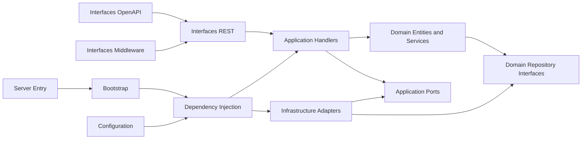

# DEPENDENCY_GRAPH

## Canonical Direction
Dependencies flow inward only.

## Canonical Module Layout
- `src/identity-platform/domain`: business rules, entities, permissions, repository interfaces.
- `src/identity-platform/application`: commands, queries, DTOs, use-case handlers, error taxonomy, ports.
- `src/identity-platform/interfaces`: REST transport, middleware, OpenAPI export.
- `src/identity-platform/infrastructure`: in-memory storage, JWT, rate limiter, email, logger, event publisher.
- `src/identity-platform/configuration`: centralized settings.
- `src/identity-platform/dependency-injection`: container assembly.
- `src/identity-platform/bootstrap`: platform creation entrypoint.

## Compatibility Surfaces
- `src/identity-platform/api.ts`: compatibility export for REST server creation.
- `src/identity-platform/service.ts`: compatibility wrapper for existing tests and callers.
- `identity-platform/package.json`: thin runtime wrapper used for container packaging only.

## Prohibited Directions
- Domain must not import infrastructure.
- Application handlers must not import REST or Node HTTP primitives.
- Interfaces must not implement business rules.
- Infrastructure must not own policy decisions.
