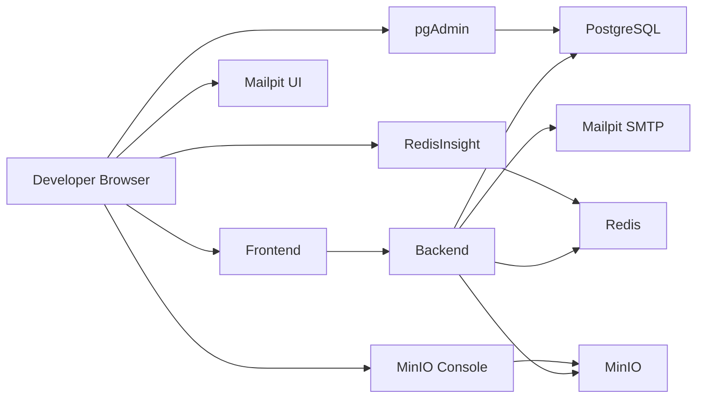

# Docker Architecture

This local platform is a Compose-only development environment that reproduces the production service topology.

## Topology

## Startup Order

1. PostgreSQL starts and passes `pg_isready`.
2. Redis starts and passes `redis-cli ping`.
3. MinIO starts and passes the live health endpoint.
4. MinIO bucket initialization completes.
5. Backend waits for the data services, runs migrations, seeds data, then starts the API.
6. Frontend starts after the backend health check succeeds.

## Runtime Contracts

- Backend uses `IDENTITY_PLATFORM_POSTGRES_URL` for PostgreSQL.
- Backend uses `IDENTITY_PLATFORM_REDIS_URL` for Redis.
- Backend uses `IDENTITY_PLATFORM_SMTP_HOST=mailpit` for email delivery.
- Storage uses `MINIO_ENDPOINT`, `AWS_ACCESS_KEY_ID`, `AWS_SECRET_ACCESS_KEY`, and `S3_FORCE_PATH_STYLE=true`.

## Persistence

- PostgreSQL data lives in `postgres_data`.
- Redis data lives in `redis_data`.
- MinIO data lives in `minio_data`.
- Backend node modules and local identity storage have their own named volumes.

## Validation Model

The backend health endpoint confirms PostgreSQL and Redis health. MinIO has its own container health check and the bootstrap waits for it before migrations and seeding.
