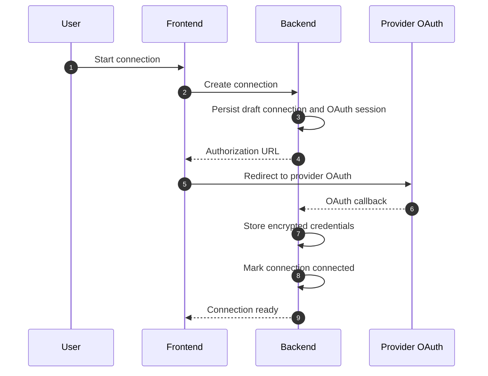
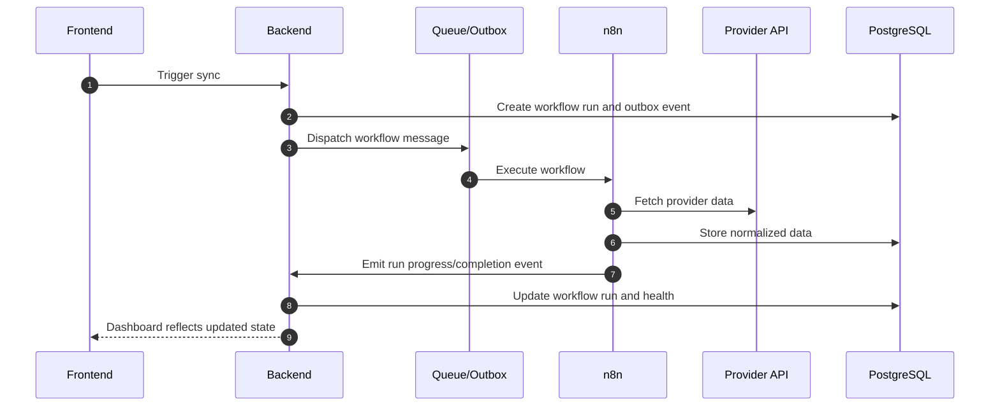
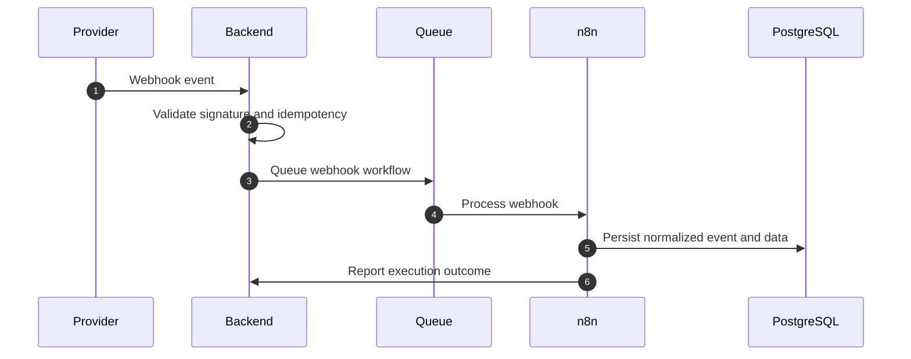
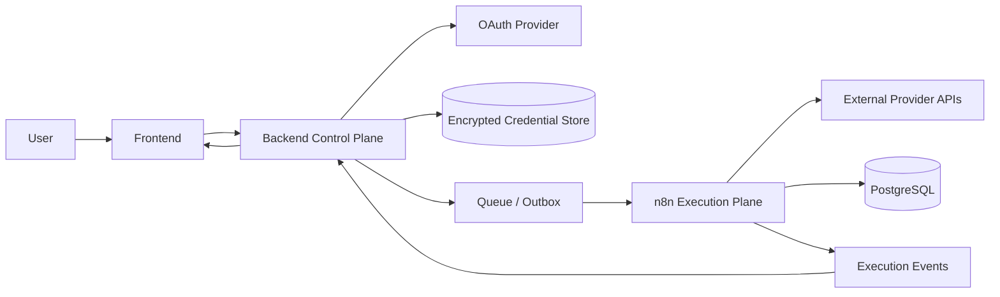
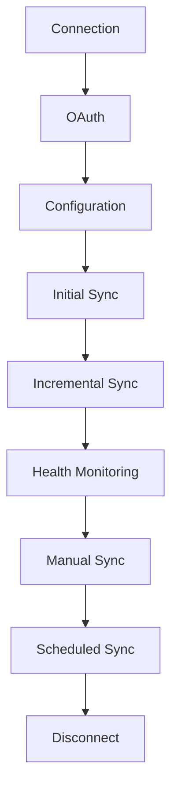
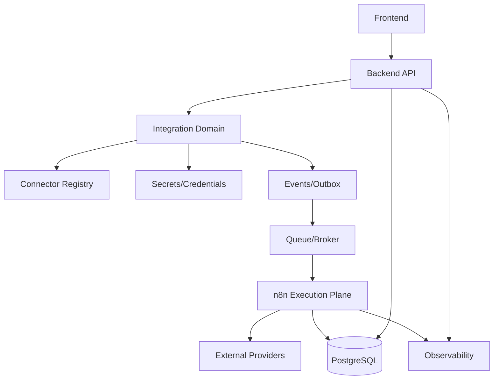

# INTEGRATION_PLATFORM_PHASE_2_DESIGN

## 1. Final Architecture

MADAR should become a control-plane / execution-plane platform.

- The backend is the control plane.
- n8n is the execution plane.
- Connectors are plugins registered into a generic platform.
- Google Ads is only Connector #1.

### Non-negotiable boundaries

- The backend owns tenants, identities, permissions, entities, metadata, secrets, audit, and workflow orchestration rules.
- n8n owns execution mechanics: retries, pagination, rate limiting, scheduling, workflow steps, transformations, and operational logging.
- Provider logic must never leak into shared business logic.
- Workflow execution must never be coupled to frontend state or local browser storage.

### Target shape

The platform should resemble a hybrid of:

- Zapier for connector breadth and trigger/action semantics
- Workato for connector orchestration and enterprise governance
- Airbyte and Fivetran for ingestion reliability and source synchronization
- Temporal for durable workflow execution and retries
- Stripe Connect for multi-tenant platform control
- Shopify App Platform for connector/plugin extensibility

But the product remains optimized for marketing intelligence, not generic automation.

## 2. Folder Structure

The current codebase already hints at the right structure under `src/integration-platform/`. That module should become the canonical platform boundary.

Recommended structure:

```text
src/
  integration-platform/
    application/
      commands/
      queries/
      contracts/
      registry/
      orchestrators/
      policies/
      validators/
    domain/
      entities/
      value-objects/
      events/
      services/
      repositories/
      errors/
    infrastructure/
      connectors/
        google-ads/
        meta-ads/
        tiktok-ads/
        snapchat-ads/
        linkedin-ads/
        ga4/
        search-console/
        shopify/
        salla/
        zid/
        woocommerce/
        hubspot/
        salesforce/
        mailchimp/
        klaviyo/
        stripe/
        ai/
      execution/
        n8n/
        queue/
        scheduler/
        retry/
        webhook/
        health/
        notifications/
      storage/
      crypto/
      observability/
    interfaces/
      rest/
      openapi/
      websocket/
      events/
      jobs/
    migrations/
```

## 3. Bounded Contexts

### Platform Control Context

Owns connector registration, connector definitions, supported capabilities, versioning, and the public integration APIs.

### Connection Context

Owns connection lifecycle, OAuth state, credential links, workspace scoping, status transitions, and disconnection.

### Execution Context

Owns workflow definitions, workflow runs, sync jobs, checkpoints, retries, job status, and dispatch to n8n.

### Health Context

Owns health scoring, provider connectivity checks, auth-expiry detection, sync freshness, and operational state.

### Eventing Context

Owns internal events, outbox entries, integration audit events, webhook events, and execution telemetry.

### Security Context

Owns secret storage, encryption, credential access auditing, token rotation, and policy checks.

### Observability Context

Owns traces, logs, metrics, correlation identifiers, and alert routing.

## 4. Service Boundaries

### Backend services

- Connector Registry Service
- OAuth Orchestration Service
- Connection Lifecycle Service
- Credential Vault Service
- Workflow Definition Service
- Workflow Dispatch Service
- Workflow Run Service
- Health Evaluation Service
- Notification Routing Service
- Audit Logging Service
- Webhook Intake Service
- Execution Event Ingest Service

### n8n services

- Workflow runners
- Provider adapters
- Pagination handlers
- Cursor management
- Retry handlers
- Rate-limited execution steps
- Transformation steps
- Notification steps

### Invariant

No n8n workflow should directly decide whether a user is allowed to connect, sync, pause, or disconnect. Those are platform decisions owned by the backend.

## 5. Domain Model

### Core entities

- ConnectorDefinition
- ConnectorCapability
- Connection
- ConnectionCredential
- OAuthSession
- WorkflowDefinition
- WorkflowVersion
- WorkflowRun
- SyncJob
- SyncCheckpoint
- ConnectorHealthSnapshot
- WebhookSubscription
- ExecutionOutboxEvent
- AuditEvent

### Key properties

- `ConnectorDefinition` is the registry record for a connector plugin.
- `Connection` is the tenant-bound configured instance of a connector.
- `WorkflowDefinition` is the abstract workflow shape for initial sync, incremental sync, webhook ingest, retry, and health check.
- `WorkflowVersion` points to a specific version of an execution graph or n8n template.
- `WorkflowRun` is the durable execution record for a dispatched workflow.
- `SyncCheckpoint` tracks resumable state.
- `ExecutionOutboxEvent` bridges state changes to external execution.

### Recommended connection state machine

- `draft`
- `authorized`
- `configured`
- `connected`
- `syncing`
- `paused`
- `degraded`
- `error`
- `disconnected`
- `deleted`

## 6. Event Model

The platform should be event-driven internally.

### Internal events

- ConnectorRegistered
- ConnectorUpdated
- OAuthSessionStarted
- OAuthSessionCompleted
- CredentialStored
- CredentialRotated
- ConnectionCreated
- ConnectionConfigured
- ConnectionValidated
- ConnectionConnected
- WorkflowDefinitionPublished
- WorkflowRunRequested
- WorkflowRunDispatched
- WorkflowRunStarted
- WorkflowRunProgressed
- WorkflowRunCompleted
- WorkflowRunFailed
- WorkflowRunRetried
- WorkflowRunCanceled
- SyncCheckpointSaved
- HealthEvaluated
- WebhookReceived
- WebhookValidated
- WebhookRejected
- NotificationRequested
- AuditRecorded

### Event envelope

Every event should include:

- event id
- event type
- aggregate id
- aggregate type
- tenant ids
- workspace id
- connector id
- connection id
- workflow run id if applicable
- correlation id
- causation id
- version
- occurred at
- payload

## 7. Database Model

The database should move toward explicit platform tables rather than provider-specific tables hidden in ad hoc modules.

### Core tables

- `connectors`
- `connector_versions`
- `connector_capabilities`
- `connections`
- `connection_credentials`
- `oauth_sessions`
- `oauth_tokens`
- `workflow_definitions`
- `workflow_versions`
- `workflow_runs`
- `sync_jobs`
- `sync_checkpoints`
- `webhook_registrations`
- `connector_health_snapshots`
- `execution_outbox`
- `integration_events`
- `integration_audit_logs`
- `integration_notifications`
- `connector_plugin_registry`
- `connector_plugin_artifacts`

### Database principles

- Strong tenant scoping on every tenant-owned table.
- Secrets encrypted at rest and never logged.
- Workflow versioning is append-only.
- Runs are immutable after completion except for operational annotations.
- Checkpoints are resumable and connector-specific but stored in a generic envelope.

### Important indexes

- `(organization_id, workspace_id, connector_id)` for connections
- `(connection_id, status, created_at)` for workflow runs and jobs
- `(connector_id, status)` for health snapshots
- `(event_type, occurred_at)` for event/audit queries
- `(workspace_id, connector_id, updated_at)` for dashboard reads

## 8. Workflow Contracts

The backend should expose generic workflow contracts, not provider-specific execution flows.

### Workflow types

- `initial_sync`
- `incremental_sync`
- `scheduled_sync`
- `manual_sync`
- `historical_backfill`
- `webhook_ingest`
- `health_check`
- `credential_refresh`
- `reconcile`
- `retry`

### Workflow request contract

- workflow definition id
- workflow version
- connector definition id
- connection id
- organization id
- workspace id
- project id if needed
- mode
- checkpoint or cursor
- idempotency key
- trigger source
- correlation id
- retry policy
- rate limit policy
- execution metadata

### Workflow response contract

- workflow run id
- external execution id
- accepted at
- status
- next action
- checkpoint snapshot
- warnings
- error summary if rejected

## 9. Queue Contracts

The queue is an execution transport, not the system of record.

### Queue message envelope

- message id
- tenant id
- connector definition id
- connection id
- workflow definition id
- workflow version
- execution id
- idempotency key
- attempt
- scheduled for
- payload
- trace context

### Queue message types

- dispatch workflow
- resume workflow
- retry workflow
- cancel workflow
- process webhook
- refresh credentials
- evaluate health
- send notification

### Required semantics

- At-least-once delivery.
- Idempotent processing.
- Deduplication by execution id and idempotency key.
- Dead-letter routing for permanent failures.

## 10. Migration Roadmap

### Phase 2 outcome

Design the target platform and its seams before implementation.

### Phase 3: Platform foundation

- Introduce a true connector registry.
- Introduce workflow definitions and workflow versions.
- Introduce dispatch/outbox records.
- Introduce execution event ingestion.
- Keep current sync behavior alive.

### Phase 4: n8n execution plane

- Add a generic backend-to-n8n execution contract.
- Move one connector workflow to n8n as the reference path.
- Maintain existing APIs and read models.

### Phase 5: Google Ads becomes reference connector

- Convert Google Ads initial sync and incremental sync to the generic execution model.
- Keep backend as source of truth.

### Phase 6: Connector factory and SDK

- Turn connector implementation patterns into reusable SDKs.
- Add provider templates.

### Phase 7: Scale-out onboarding

- Onboard Meta Ads, TikTok, Shopify, and GA4 using the same lifecycle.

## 11. Risks

- Over-centralizing orchestration in the backend and recreating a workflow engine there.
- Letting n8n accumulate business logic beyond execution.
- Insufficient idempotency on sync and webhook paths.
- Workflow version drift between backend registry and n8n definitions.
- Too much connector-specific branching in shared services.
- Multi-tenant leakage through query filters or background jobs.
- Secrets exposure through logs or debug payloads.

## 12. Rollback Strategy

Every migration slice should be reversible.

### Rollback principles

- Keep the legacy execution path available until the new path is proven.
- Use feature flags per connector and per workflow type.
- Dual-write execution metadata during transition if needed.
- Preserve read models during migration.
- Never delete old workflow definitions until parity is verified.

### Safe rollback boundaries

- Roll back n8n dispatch to backend-native execution.
- Roll back connector version selection to the last known good workflow version.
- Roll back only one connector at a time.

## 13. Recommended Technologies

### Backend

- TypeScript
- PostgreSQL
- Redis for queue coordination and rate limiting
- Outbox pattern for durable event publication
- Object storage for raw webhook payloads and workflow artifacts

### Execution

- n8n as the generic workflow execution engine
- Queue or broker for dispatch transport
- Worker processes for dispatch/event processing

### Observability

- OpenTelemetry
- Structured logs
- Prometheus-compatible metrics
- Trace correlation across backend, queue, and n8n

### Security

- Envelope encryption for secrets
- KMS-backed key management in production
- Scoped service credentials
- Signed webhook payload verification

## 14. Sequence Diagrams

### Connection and OAuth



### Workflow execution through n8n



### Webhook ingest



## 15. Data Flow Diagrams

### Primary platform flow



### Connector lifecycle flow



## 16. Dependency Graph

The dependency graph should be one-directional.



### Dependency rules

- Frontend depends on backend only.
- Backend depends on domain abstractions and infrastructure ports.
- n8n depends on execution contracts, not on backend internals.
- Connector implementations depend on SDKs and shared domain contracts, not on frontend state.

## 17. Security Model

### Principles

- Least privilege per connector, per tenant, per environment.
- Encrypt tokens and secrets at rest.
- Sign and verify webhook traffic.
- Keep raw provider payloads out of general logs.
- Separate operator credentials from tenant credentials.
- Audit every sensitive mutation.

### Secret handling

- OAuth refresh tokens are encrypted before persistence.
- Execution tokens for n8n should be short-lived and scoped.
- Service-to-service auth should use signed tokens or mTLS in production.
- Webhook secrets must be rotated and versioned.

### Tenant isolation

- Every query must be scoped by organization and workspace.
- Queue messages must include tenant context.
- Execution workers must reject cross-tenant references.

## 18. Scaling Strategy

### Horizontal scale

- Backend API scales independently from execution workers.
- n8n workers scale horizontally by connector load and workflow type.
- Queue consumers can be partitioned by connector or tenant.

### Backpressure

- Rate limits per connector and provider.
- Concurrency caps per tenant.
- Circuit breakers for unstable providers.
- Queue depth monitoring with automatic throttling.

### High-volume design

- Thousands of concurrent syncs should be handled by worker pools, not synchronous request threads.
- Long-running imports should be resumable through checkpoints.
- Retry storms should be prevented by jitter, max attempts, and dead-letter queues.

## 19. Multi-Tenant Strategy

### Tenant hierarchy

- Organization
- Workspace
- Project
- Connection
- Workflow run

### Isolation model

- Logical tenant isolation in PostgreSQL by tenant columns.
- Optional row-level security for hard isolation in sensitive deployments.
- Connection metadata and workflow state must always be tenant-scoped.
- Queue partitions should prevent one tenant from starving another.

### Enterprise readiness

- Per-tenant limits and quotas
- Connector allowlists
- Audit export
- Dedicated worker pools if needed
- Environment isolation by deployment tier

## 20. Future Roadmap

### Near term

- Finalize connector registry and execution contracts.
- Introduce workflow definition/version entities.
- Stand up n8n as the generic execution engine.
- Move one connector path end-to-end.

### Medium term

- Add a connector SDK so future connectors are mostly configuration plus adapters.
- Add webhook-first connectors and polling fallback connectors.
- Add AI-triggered workflows and enrichment workflows.

### Long term

- Connector marketplace model.
- Connector version pinning and safe upgrades.
- Advanced dependency graphs between workflows.
- Cross-connector orchestration and AI-powered insights.

## Design Verdict

The current architecture is not yet sufficient for a five-year platform if it keeps workflow execution, connector orchestration, and state ownership mixed across frontend-local state and provider-specific logic.

The clean long-term design is:

- Backend as the integration control plane
- n8n as the generic execution plane
- Connectors as plugins
- Workflows as versioned contracts
- Events and outbox as the reliability backbone
- PostgreSQL as source of truth
- Redis/queue as transport and coordination

That design scales to dozens of connectors without forcing new backend architecture for each one.
