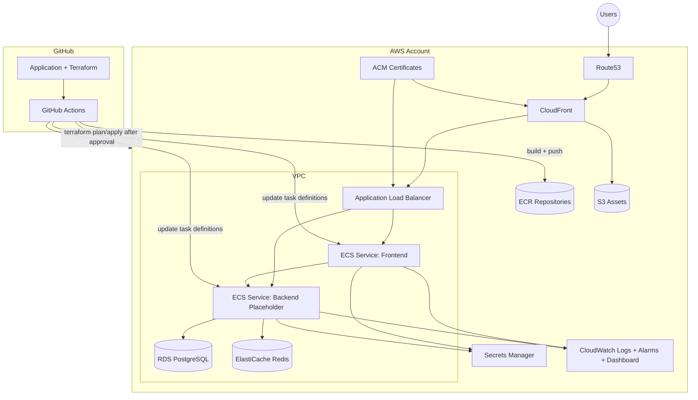
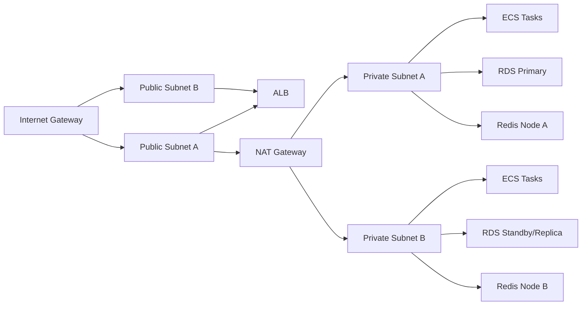

# MADAR AWS Architecture Review Pack

Status: design complete, review pending, no infrastructure provisioned.

## 1. Complete Terraform Structure

```text
terraform/
  README.md
  modules/
    vpc/{main.tf,variables.tf,outputs.tf}
    ecs/{main.tf,variables.tf,outputs.tf}
    alb/{main.tf,variables.tf,outputs.tf}
    rds/{main.tf,variables.tf,outputs.tf}
    redis/{main.tf,variables.tf,outputs.tf}
    cloudfront/{main.tf,variables.tf,outputs.tf}
    route53/{main.tf,variables.tf,outputs.tf}
    acm/{main.tf,variables.tf,outputs.tf}
    ecr/{main.tf,variables.tf,outputs.tf}
    iam/{main.tf,variables.tf,outputs.tf}
    secrets/{main.tf,variables.tf,outputs.tf}
    cloudwatch/{main.tf,variables.tf,outputs.tf}
  environments/
    local/{versions.tf,main.tf,variables.tf,outputs.tf,terraform.tfvars.example}
    stage/{versions.tf,main.tf,variables.tf,outputs.tf,terraform.tfvars.example}
    production/{versions.tf,main.tf,variables.tf,outputs.tf,terraform.tfvars.example}
```

## 3. AWS Architecture Diagram



## 4. Networking Diagram



## 5. Cost Estimation (Monthly, rough, eu-central-1)

Assumptions:
- Frontend and backend always-on.
- Stage runs reduced sizes.
- Data transfer is moderate.
- Prices vary by reservation model and traffic profile.

| Component | Stage (USD/mo) | Production (USD/mo) |
|---|---:|---:|
| ECS Fargate (frontend + backend) | 110-180 | 400-900 |
| ALB | 25-50 | 60-180 |
| RDS PostgreSQL | 90-180 | 350-900 |
| ElastiCache Redis | 40-90 | 180-500 |
| NAT Gateway + egress | 40-90 | 100-350 |
| CloudFront + data transfer | 20-120 | 150-1200 |
| S3 assets + requests | 5-25 | 20-180 |
| CloudWatch logs/alarms | 15-40 | 60-220 |
| Route53 + ACM | 3-20 | 10-60 |
| **Estimated Total** | **348-795** | **1330-4490** |

## 6. Security Checklist

- [x] Separate stage and production stacks/state backends.
- [x] Private subnets for ECS, RDS, and Redis.
- [x] Public exposure limited to ALB and CloudFront.
- [x] TLS enforced on ALB listener and CloudFront viewer.
- [x] ACM-managed certificates.
- [x] Secrets stored in Secrets Manager.
- [x] Runtime secret access restricted via IAM role.
- [x] OIDC-based GitHub Actions role assumption (no long-lived keys).
- [x] ECR immutable tags with scan-on-push.
- [x] S3 encryption and public access block.
- [x] RDS/Redis encryption at rest and in transit.
- [x] Centralized CloudWatch logs and alarms.
- [x] Deployment circuit breaker and rollback enabled on ECS services.

Open hardening recommendations before go-live:
- Add AWS WAF on CloudFront and/or ALB.
- Enable AWS Shield Advanced for production.
- Enable GuardDuty, Security Hub, and Config conformance packs.
- Restrict RDS/Redis SG ingress to ECS SG only after introducing a shared app SG module.

## 7. Environment Variables Inventory

| Variable | Frontend | Backend | Stage | Production | Source |
|---|---|---|---|---|---|
| NODE_ENV | yes | yes | production | production | terraform var |
| NEXT_PUBLIC_APP_URL | yes | no | yes | yes | route/domain |
| NEXT_PUBLIC_API_BASE_URL | yes | no | yes | yes | route/domain |
| NEXT_PUBLIC_APP_RUNTIME_MODE | yes | no | stage | production | terraform var |
| APP_ENV | no | yes | stage | production | terraform var |
| PORT | no | yes | 4000 | 4000 | terraform var |
| DB_HOST | no | yes | yes | yes | RDS output |
| DB_PORT | no | yes | yes | yes | RDS output |
| DB_NAME | no | yes | yes | yes | terraform var |
| DB_USER | no | yes | yes | yes | terraform var |
| REDIS_HOST | no | yes | yes | yes | Redis output |
| REDIS_PORT | no | yes | yes | yes | terraform var |
| S3_BUCKET_ASSETS | no | yes | yes | yes | S3 output |
| DB_PASSWORD | no | secret | yes | yes | Secrets Manager |
| JWT_SIGNING_KEY | no | secret | yes | yes | Secrets Manager |
| SESSION_SECRET | secret | no | yes | yes | Secrets Manager |

## 8. IAM Policy Matrix

| Role | Trust Principal | Key Permissions | Scope |
|---|---|---|---|
| ECS Task Execution | ecs-tasks.amazonaws.com | pull images, write logs | per environment |
| ECS Task Runtime | ecs-tasks.amazonaws.com | read runtime secrets, write logs | per environment |
| GitHub Actions Deploy | GitHub OIDC subject repo:owner/repo | ECR push, ECS task/service update, pass role, state lock access | per environment |
| Deployment Operator | named IAM principals | PowerUserAccess (can be replaced with tighter custom policy) | per environment |

## 9. Secrets Inventory

| Secret Name | Purpose | Rotation | Consumers |
|---|---|---|---|
| db-master | PostgreSQL master password | 90 days | backend, migrations |
| oauth-google | Google OAuth client secret | 90 days | backend auth |
| oauth-meta | Meta OAuth secret | 90 days | backend auth |
| webhook-signing-key | Webhook validation | 60 days | backend webhooks |
| jwt-signing-key | Access/refresh token signing | 60 days | backend auth |
| redis-auth-token | Redis AUTH token | 90 days | backend/workers |
| frontend-session-secret | Session cookie encryption | 60 days | frontend |
| backend-encryption-secret | app-level encryption | 90 days | backend/workers |

## 15. Monitoring Dashboard Plan

Primary CloudWatch dashboard widgets:
- ECS CPU and memory by service (frontend/backend/workers).
- ECS task count vs desired count.
- ALB request count, latency p95, target 4xx and 5xx.
- CloudFront request/error/cache-hit rates.
- RDS CPU, free storage, read/write latency, connections.
- Redis CPU, memory, evictions, connection count.
- NAT egress bytes and packet drops.
- Error logs and auth/webhook failure counts (metric filters).

Critical alarms:
- ALB target 5xx > threshold.
- ECS CPU > 75% sustained.
- RDS CPU > 75% sustained.
- Redis CPU > 75% sustained.
- CloudFront 5xx spike.
- Secret rotation failures.

Notification channels:
- SNS email endpoints per environment.
- Optional Slack/PagerDuty via SNS integrations.
