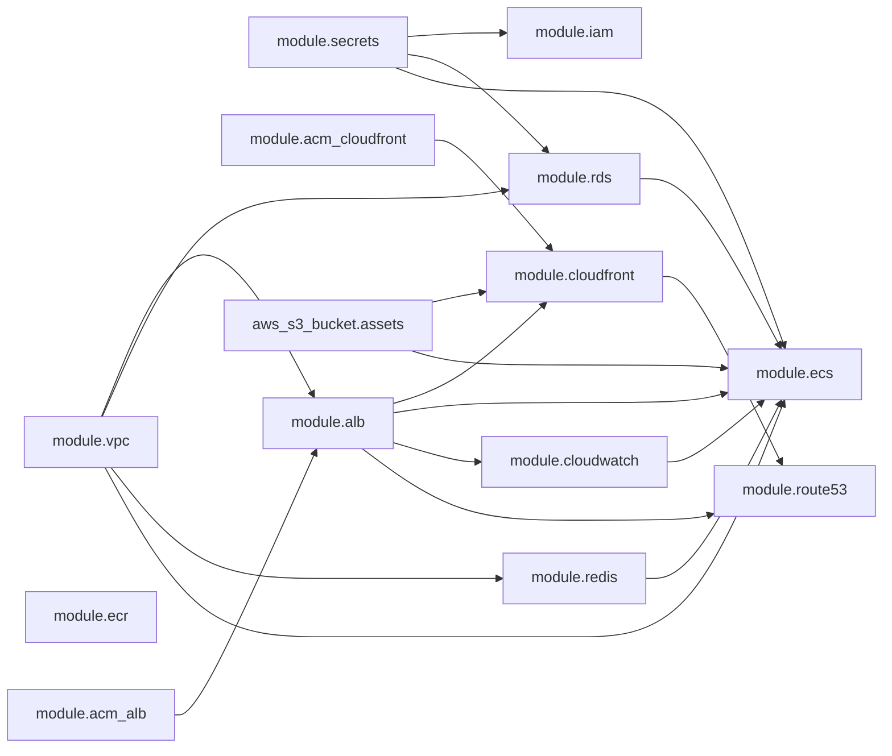

# Infrastructure Validation Report (Pre-Provision)

Date: 2026-06-23
Status: Review complete, no provisioning executed

## Scope

- Terraform module validation for all modules.
- Terraform environment validation for local, stage, production.
- Terraform plan execution attempt for local, stage, production.
- Dependency graph extraction.
- Architecture review: security, scalability, cost, AWS best practices, HA, DR.

## Commands Executed

- Terraform installation:
  - `brew tap hashicorp/tap`
  - `brew install hashicorp/tap/terraform`
  - `terraform version` -> `Terraform v1.15.6`
- Formatting:
  - `terraform fmt -recursive terraform`
- Module validation:
  - `terraform init -backend=false -reconfigure && terraform validate` in each module directory.
- Environment validation:
  - `terraform init -backend=false -reconfigure && terraform validate` for local, stage, production.
- Plan attempts:
  - Real backends: `terraform init -reconfigure` then `terraform plan ...`
  - Sandbox (backend stripped only in `/tmp` copy): `terraform init -reconfigure` then `terraform plan ...`

## Validation Results

### 1) Terraform fmt

Result: PASS.

### 2) Terraform validate (modules)

Result: PASS for all modules:
- acm
- alb
- cloudfront
- cloudwatch
- ecr
- ecs
- iam
- rds
- redis
- route53
- secrets
- vpc

### 3) Terraform validate (environments)

Result: PASS for local, stage, production.

### 4) Terraform plan

Result: BLOCKED (all environments).

Blocking runtime error:
- `No valid credential sources found`
- Provider initialization fails for both `aws` and `aws.use1`.

Interpretation:
- The Terraform code is syntactically and structurally valid.
- Plan cannot execute against real providers without AWS credentials and accessible backend prerequisites.

## Fixes Applied During Review

- Added explicit provider declaration in ACM module to eliminate undefined-provider warning when passing aliased provider.
- Replaced deprecated S3 backend `dynamodb_table` with `use_lockfile = true` in all environments.
- Removed obsolete DynamoDB lock table variables and related IAM backend permission references in environment compositions.

## Dependency Graph (Module Relationships)

## Architecture Review

### Security

Strengths:
- Private subnets for ECS/RDS/Redis.
- TLS on ALB and CloudFront.
- Secrets in Secrets Manager.
- OIDC-based CI auth model.
- S3 encryption and public access block.

Gaps to fix before first apply:
- RDS/Redis ingress uses VPC CIDR, not ECS-security-group-only rules.
- Deployment operator role uses broad power permissions.
- No WAF/Web ACL attached to CloudFront or ALB.

### Scalability

Strengths:
- ECS service autoscaling targets configured.
- CloudFront fronting app traffic.
- Redis replication and failover enabled.

Gaps:
- Worker service is not yet implemented (future background jobs not provisioned).
- No queue/event backbone provisioned yet (SQS/EventBridge) for asynchronous workloads.

### Cost Optimization

Strengths:
- Stage sizing lower than production.
- ECR lifecycle retention enabled.

Gaps:
- Single NAT gateway per environment may become egress bottleneck or SPOF while still incurring fixed cost.
- No Savings Plans/RI strategy codified yet.

### AWS Best Practices

Strengths:
- Environment isolation by separate stacks/backends.
- Centralized log groups and alarms.

Gaps:
- Need explicit backup-account copy policy for RDS snapshots.
- Need Access Analyzer/Security Hub/GuardDuty baseline in IaC.

### High Availability

Strengths:
- Multi-AZ subnet design.
- ALB across public subnets.
- ECS desired count > 1.

Gaps:
- Stage RDS configured non-Multi-AZ intentionally (acceptable for stage, not production).
- NAT gateway HA not achieved with single NAT design.

### Disaster Recovery

Strengths:
- Retention settings for RDS/Redis backups.
- Documented DR and rollback strategy.

Gaps:
- Cross-region DR resources are documented but not yet codified.
- Recovery drills are procedural only; no automation pipelines yet.

## Readiness Score

Score: 82/100

Rationale:
- +35: Terraform module and environment validation cleanliness.
- +20: Security baseline controls present.
- +12: HA and scaling foundation present.
- +8: Operational docs and rollback/DR plans present.
- -15: Plan blocked by missing AWS credential/backend readiness.
- -8: Security hardening gaps (WAF, tighter SG, least privilege role refinement).
- -5: DR automation and async architecture components not yet codified.

## Blockers Before First terraform apply

1. Configure valid AWS credentials (or GitHub OIDC role assumption path) for Terraform runtime.
2. Ensure backend S3 buckets exist and are reachable:
   - `madar-terraform-state-local`
   - `madar-terraform-state-stage`
   - `madar-terraform-state-production`
3. Confirm backend IAM permissions allow S3 lockfile operations (get/put/delete/list).
4. Populate required secret values for critical secrets before workload start.
5. Tighten network controls for RDS/Redis from VPC CIDR to app-security-group-only.
6. Replace broad deployment operator permissions with least-privilege custom policy.
7. Add WAF in front of CloudFront/ALB for production edge protection.
8. Validate domain and Route53 hosted-zone ownership for certificate DNS validation.

## Non-Blocking Recommendations

- Add queue and worker services for background jobs.
- Add backup-copy and cross-region DR IaC.
- Add cost controls (budgets, anomaly detection, SP/RI policy).
