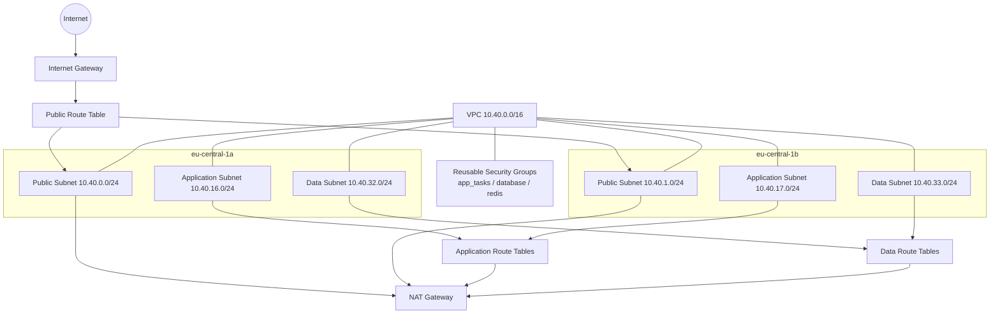

# MADAR Stage Networking Review

Date: 2026-06-24
Scope: Stage networking foundation only. No compute, data, DNS, or application resources are included.

## Decision Summary

The Stage networking layer is designed for a production-grade foundation in `eu-central-1` using two Availability Zones and a `10.40.0.0/16` CIDR block.

Final design choices:
- Two public subnets across two AZs.
- Two application subnets across two AZs.
- Two data subnets across two AZs.
- One NAT gateway and one EIP for Stage cost optimization.
- One public route table, plus separate application and data route tables per AZ.
- Reusable security groups for future ECS, RDS, and Redis stacks.
- Default NACLs retained.
- No VPC endpoints in this sprint.

## Architecture Review

### High Availability

The subnet layout remains multi-AZ and future workloads can be placed across both AZs without changing the networking layer.

Important tradeoff:
- Stage internet egress now uses a single NAT gateway, so NAT egress itself is not multi-AZ resilient.
- This is an intentional cost optimization for Stage only.
- Production remains on dual NAT gateways.

### Security

- Public, application, and data traffic are separated into dedicated subnet tiers.
- Public subnets are only for ingress and NAT placement.
- Application subnets are isolated from data subnets.
- Private subnets do not receive public IPs.
- Security groups are reusable and not over-permissive.
- Default NACLs are used because SGs provide the primary control plane and custom NACLs would add complexity without a clear benefit for this sprint.

### CIDR Allocation

The layout avoids overlap and reserves growth room between tiers:

| Tier | CIDR | AZ | Purpose |
|---|---|---|---|
| VPC | 10.40.0.0/16 | eu-central-1 | Stage network boundary |
| Public A | 10.40.0.0/24 | eu-central-1a | NAT gateway and future ingress |
| Public B | 10.40.1.0/24 | eu-central-1b | NAT gateway and future ingress |
| Application A | 10.40.16.0/24 | eu-central-1a | Future ECS workloads |
| Application B | 10.40.17.0/24 | eu-central-1b | Future ECS workloads |
| Data A | 10.40.32.0/24 | eu-central-1a | Future RDS / Redis workloads |
| Data B | 10.40.33.0/24 | eu-central-1b | Future RDS / Redis workloads |

The ranges do not overlap.

### Future ECS / RDS / Redis Compatibility

This VPC can host future stacks without network redesign because:
- ECS tasks can use the application subnets directly.
- RDS and Redis can use the dedicated data subnets directly.
- Route tables are already separated by tier.
- The VPC has reserved space for future expansion.

## Topology Diagram

## Availability Zone Mapping

| AZ | Public Subnet | Application Subnet | Data Subnet |
|---|---|---|---|
| eu-central-1a | 10.40.0.0/24 | 10.40.16.0/24 | 10.40.32.0/24 |
| eu-central-1b | 10.40.1.0/24 | 10.40.17.0/24 | 10.40.33.0/24 |

## Route Table Matrix

| Route Table | Attached Subnets | Default Route | Purpose |
|---|---|---|---|
| Public Route Table | 10.40.0.0/24, 10.40.1.0/24 | 0.0.0.0/0 -> Internet Gateway | Public ingress and NAT placement |
| Application Route Tables | 10.40.16.0/24, 10.40.17.0/24 | 0.0.0.0/0 -> NAT Gateway | Future ECS workloads |
| Data Route Tables | 10.40.32.0/24, 10.40.33.0/24 | 0.0.0.0/0 -> NAT Gateway | Future RDS and Redis workloads |

## Security Group Matrix

| Security Group | Intended Use | Ingress | Egress |
|---|---|---|---|
| app_tasks | Future ECS tasks | None yet | Allow all outbound |
| database | Future RDS tier | None yet | Allow all outbound |
| redis | Future Redis tier | None yet | Allow all outbound |

## VPC Endpoint Review

No VPC endpoints are created in this sprint.

Reason:
- There is no current compute or data plane that would immediately consume private ECR, SSM, CloudWatch, or S3 endpoints.
- The single NAT gateway is sufficient for Stage traffic and keeps the design simple.
- Endpoints can be added later if workload patterns justify the cost/security tradeoff.

## Estimated Monthly AWS Cost

Baseline estimate for the networking layer in `eu-central-1`:

| Item | Quantity | Estimated Monthly Cost |
|---|---|---|
| NAT Gateway | 1 | about $32.85 |
| Elastic IP attached to NAT | 1 | $0.00 |
| VPC, subnets, route tables, SGs, IGW | n/a | $0.00 |
| VPC endpoints | 0 | $0.00 |

Estimated total: about $33/month before data transfer, cross-AZ traffic, and any future endpoints.

## Review Verdict

Approved for Stage cost-optimized networking, with the explicit understanding that NAT egress is no longer multi-AZ resilient in Stage.

Remaining follow-ups for later sprints:
- Add workload-specific security group ingress rules from compute and data stacks.
- Consider VPC endpoints once ECS/ECR/CloudWatch traffic patterns are known.
- Mirror the pattern into production with production-specific CIDRs and dual NAT gateways.
