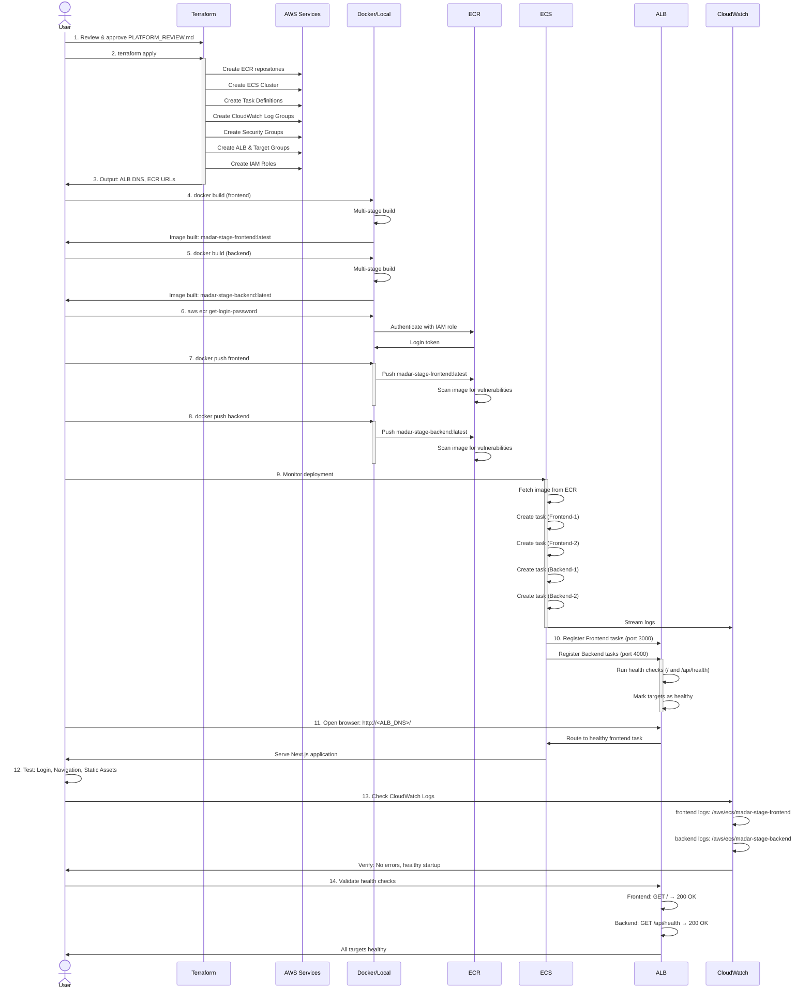

# MADAR Stage Platform - Deployment Flow

## End-to-End Deployment Sequence

This diagram shows the complete deployment workflow from Terraform apply through production validation.



---

## Detailed Steps

### Phase 1: Infrastructure Provisioning (Terraform)

```
terraform apply -var-file=terraform.tfvars
│
├─ Create S3 state file: stage/platform.tfstate
├─ Create ECR repositories
│  ├─ madar-stage/frontend
│  └─ madar-stage/backend
├─ Create ECS Cluster
│  └─ madar-stage-cluster
├─ Create CloudWatch Log Groups (7-day retention)
│  ├─ /aws/ecs/madar-stage-frontend
│  └─ /aws/ecs/madar-stage-backend
├─ Create Security Groups
│  ├─ ALB Security Group (ports 80, 443)
│  └─ App Tasks Security Group (ports 3000, 4000)
├─ Create Application Load Balancer
│  ├─ madar-stage-alb
│  └─ Subnets: 10.40.0.0/24 (AZ-a), 10.40.1.0/24 (AZ-b)
├─ Create Target Groups
│  ├─ madar-stage-frontend-tg (port 3000, health: /)
│  └─ madar-stage-backend-tg (port 4000, health: /api/health)
├─ Create HTTP Listener (port 80)
│  └─ Routes to: frontend target group
├─ Create ECS Task Definitions
│  ├─ madar-stage-frontend (256 CPU, 512 MB RAM)
│  └─ madar-stage-backend (256 CPU, 512 MB RAM)
├─ Create ECS Services
│  ├─ madar-stage-frontend-service (desired: 2)
│  └─ madar-stage-backend-service (desired: 2)
├─ Create IAM Roles & Policies
│  ├─ ecs-task-execution-role (ECR pull, logs, secrets)
│  └─ ecs-task-role (empty by default)
└─ Output Endpoints
   ├─ ALB DNS: madar-stage-alb-123456789.eu-central-1.elb.amazonaws.com
   ├─ ECR Frontend: 123456789.dkr.ecr.eu-central-1.amazonaws.com/madar-stage/frontend
   └─ ECR Backend: 123456789.dkr.ecr.eu-central-1.amazonaws.com/madar-stage/backend

Duration: ~3-5 minutes
```

### Phase 2: Image Building (Local Docker)

```
Docker Build Process (Local Machine)
│
├─ Frontend Build
│  ├─ Stage 1: dependencies (FROM node:22-alpine)
│  │  └─ npm ci (install production deps only)
│  ├─ Stage 2: builder
│  │  └─ npm run build → /app/out
│  └─ Stage 3: runtime
│     ├─ Copy node_modules (production)
│     ├─ Copy /out (static export)
│     ├─ Create non-root user: nextjs:1001
│     ├─ Configure health check: GET / → 200
│     └─ CMD: ["node", "-e", "serve(['./out'], { port: 3000 })"]
│
├─ Backend Build
│  ├─ FROM node:22-alpine
│  ├─ Copy server.js (embedded)
│  ├─ Create non-root user: appuser:1001
│  ├─ Configure health check: GET /api/health → 200
│  ├─ Handle SIGTERM for graceful shutdown
│  └─ CMD: ["node", "/app/server.js"]
│
├─ Image Tags
│  ├─ madar-stage-frontend:latest
│  └─ madar-stage-backend:latest
│
└─ Image Sizes (Typical)
   ├─ Frontend: ~200-300 MB (with node_modules + next.js output)
   └─ Backend: ~100-150 MB (node:22-alpine + http server)

Duration: ~2-5 minutes (depends on cached layers)
```

### Phase 3: Image Registry (ECR)

```
ECR Push Workflow
│
├─ Authenticate with AWS
│  └─ aws ecr get-login-password | docker login
│
├─ Frontend Push
│  ├─ docker push 123456789.dkr.ecr.eu-central-1.amazonaws.com/madar-stage/frontend:latest
│  ├─ ECR receives layers
│  ├─ Scan image for CVEs
│  ├─ Store in ECR repository
│  └─ Tag available for ECS deployment
│
├─ Backend Push
│  ├─ docker push 123456789.dkr.ecr.eu-central-1.amazonaws.com/madar-stage/backend:latest
│  ├─ ECR receives layers
│  ├─ Scan image for CVEs
│  ├─ Store in ECR repository
│  └─ Tag available for ECS deployment
│
└─ ECR Status
   ├─ Images scanned automatically
   ├─ Vulnerabilities reported
   ├─ Ready for deployment

Duration: ~1-3 minutes (depends on image size and network)
```

### Phase 4: ECS Deployment

```
ECS Task Startup Sequence
│
├─ Service: madar-stage-frontend-service
│  ├─ Current desired count: 2
│  ├─ Launch task 1 (AZ-a, Subnet 10.40.16.0/24)
│  │  ├─ Fetch task definition: madar-stage-frontend:1
│  │  ├─ Pull image: ECR → Container Image
│  │  ├─ Assume IAM role: ecs-task-execution-role
│  │  │  ├─ Access CloudWatch logs
│  │  │  ├─ Verify ECR authentication
│  │  │  └─ Retrieve any required secrets
│  │  ├─ Mount volumes (none for stage)
│  │  ├─ Configure networking
│  │  │  ├─ Assign ENI with private IP
│  │  │  ├─ Apply security group: app_tasks
│  │  │  └─ Enable NAT gateway egress
│  │  ├─ Start container (port 3000)
│  │  │  ├─ Run CMD: serve(['./out'], port: 3000)
│  │  │  ├─ Startup logs to CloudWatch
│  │  │  └─ Wait for health check pass
│  │  ├─ Register with ALB target group
│  │  │  ├─ ALB runs health check: GET /
│  │  │  ├─ Expected: 200 OK
│  │  │  ├─ Interval: 30s
│  │  │  ├─ Healthy threshold: 2 successful checks
│  │  │  └─ Task moves to RUNNING state
│  │  └─ Monitor: Ready to serve traffic
│  │
│  └─ Launch task 2 (AZ-b, Subnet 10.40.17.0/24) [same as task 1]
│
├─ Service: madar-stage-backend-service
│  ├─ Current desired count: 2
│  ├─ Launch task 1 (AZ-a, Subnet 10.40.16.0/24)
│  │  ├─ Fetch task definition: madar-stage-backend:1
│  │  ├─ Pull image: ECR → Container Image
│  │  ├─ Assume IAM role: ecs-task-execution-role
│  │  ├─ Start container (port 4000)
│  │  │  ├─ Run CMD: node /app/server.js
│  │  │  ├─ Startup logs to CloudWatch
│  │  │  ├─ Bind to 0.0.0.0:4000
│  │  │  └─ Wait for health check pass
│  │  ├─ Register with ALB target group
│  │  │  ├─ ALB runs health check: GET /api/health
│  │  │  ├─ Expected: 200 OK + JSON response
│  │  │  ├─ Interval: 30s
│  │  │  ├─ Healthy threshold: 2 successful checks
│  │  │  └─ Task moves to RUNNING state
│  │  └─ Monitor: Ready to serve traffic
│  │
│  └─ Launch task 2 (AZ-b, Subnet 10.40.17.0/24) [same as task 1]
│
├─ Target Group Status
│  ├─ Frontend: 2 healthy targets (10.40.16.x:3000, 10.40.17.x:3000)
│  └─ Backend: 2 healthy targets (10.40.16.x:4000, 10.40.17.x:4000)
│
├─ CloudWatch Logs
│  ├─ /aws/ecs/madar-stage-frontend
│  │  └─ Task startup logs, app logs, errors
│  └─ /aws/ecs/madar-stage-backend
│     └─ Task startup logs, app logs, errors
│
└─ Service State
   ├─ ECS Service ACTIVE
   ├─ Desired: 4 tasks (2 frontend + 2 backend)
   ├─ Running: 4 tasks
   └─ Status: HEALTHY

Duration: ~2-3 minutes (image pull + startup)
```

### Phase 5: Load Balancer Routing

```
ALB Request Flow
│
├─ Incoming Request: GET http://<ALB_DNS>/
│
├─ ALB Processing
│  ├─ Listen on port 80 (HTTP)
│  ├─ Receive request on internet-facing interface
│  ├─ Check routing rules
│  │  └─ Default action: Forward to frontend target group
│  ├─ Select healthy target
│  │  ├─ Frontend TG has 2 healthy targets
│  │  ├─ ALB uses round-robin load distribution
│  │  └─ Route to: 10.40.16.x:3000 (or 10.40.17.x:3000)
│  ├─ Add headers
│  │  ├─ X-Forwarded-For: <client_ip>
│  │  ├─ X-Forwarded-Proto: http
│  │  └─ X-Forwarded-Port: 80
│  └─ Forward to target
│
├─ Frontend Task Processing
│  ├─ Receive request: GET / + headers
│  ├─ Run: node -e serve(['./out'], { port: 3000 })
│  ├─ Return: static Next.js export
│  ├─ Response: 200 OK + HTML + CSS + JS
│  └─ Return to ALB
│
├─ ALB Response Handling
│  ├─ Receive response from frontend
│  ├─ Forward to client
│  └─ Connection complete
│
└─ Browser
   ├─ Receive HTML, CSS, JavaScript
   ├─ Render MADAR UI
   └─ User sees: Login page / Dashboard

Duration: ~100-500ms (depends on content size + network)
```

### Phase 6: Validation & Monitoring

```
Post-Deployment Checks
│
├─ Application Reachability
│  └─ curl http://<ALB_DNS>/
│     └─ Expected: 200 OK + HTML
│
├─ Frontend Functionality
│  ├─ Login page loads: ✓
│  ├─ Authentication works: ✓
│  ├─ Navigation loads: ✓
│  ├─ Static assets load: ✓
│  └─ Theme loads: ✓
│
├─ Backend Connectivity
│  └─ curl http://<ALB_DNS>/api/health
│     └─ Expected: 200 OK + {"status": "ok"}
│
├─ CloudWatch Logs
│  ├─ /aws/ecs/madar-stage-frontend
│  │  ├─ No ERROR level logs in startup
│  │  ├─ Health check logs: healthy
│  │  └─ Request logs: normal volume
│  └─ /aws/ecs/madar-stage-backend
│     ├─ No ERROR level logs in startup
│     ├─ Health check logs: healthy
│     └─ API request logs: normal volume
│
├─ ALB Metrics
│  ├─ Target Health: All HEALTHY
│  ├─ Request Count: Increasing
│  ├─ HTTP 2xx Response Count: Increasing
│  ├─ HTTP 5xx Response Count: 0
│  └─ Target Response Time: <500ms
│
├─ ECS Metrics
│  ├─ CPU Utilization: < 50% (expected for light traffic)
│  ├─ Memory Utilization: < 60% (expected with 512MB limit)
│  ├─ Task Count: 4 (2 frontend, 2 backend)
│  └─ Service Status: ACTIVE
│
└─ Success Criteria Validation
   ├─ ✓ Docker image built correctly
   ├─ ✓ Image pushed to ECR
   ├─ ✓ ECS started successfully
   ├─ ✓ Application reachable via ALB
   ├─ ✓ Authentication works
   ├─ ✓ Routing works
   ├─ ✓ Static assets load
   ├─ ✓ Logging works
   └─ ✓ Health checks pass

Duration: Manual validation ~5-10 minutes
```

---

## Timeline Estimate

| Phase | Task | Duration | Cumulative |
|-------|------|----------|-----------|
| 1 | Terraform apply | 3-5 min | 3-5 min |
| 2 | Build Docker images | 2-5 min | 5-10 min |
| 3 | Push to ECR | 1-3 min | 6-13 min |
| 4 | ECS deployment | 2-3 min | 8-16 min |
| 5 | ALB stabilization | 0-2 min | 8-18 min |
| 6 | Validation tests | 5-10 min | 13-28 min |
| **TOTAL** | **End-to-End Deployment** | **~30-40 minutes** | |

---

## Rollback Procedures

### Immediate Rollback (Same Day)

```bash
# Option 1: Scale service to 0 (pause without deletion)
aws ecs update-service \
  --cluster madar-stage-cluster \
  --service madar-stage-frontend-service \
  --desired-count 0

aws ecs update-service \
  --cluster madar-stage-cluster \
  --service madar-stage-backend-service \
  --desired-count 0

# Expected: Tasks stop gracefully within 2-3 minutes
# Outcome: ALB returns 503 Service Unavailable
# Recovery: Scale back to desired-count 2 when ready
```

### Delete Stack (Full Cleanup)

```bash
# WARNING: This deletes all infrastructure
# Backup CloudWatch logs first if needed

cd terraform/environments/stage-platform
terraform destroy -var-file=terraform.tfvars

# Expected: 15 resources destroyed
# Duration: ~2-3 minutes
# Result: Clean slate for re-deployment
```

### Revert Code Changes

```bash
# If Dockerfile changes caused issues
git checkout HEAD -- Dockerfile.frontend Dockerfile.backend

# Rebuild and repush images
docker build -t madar-stage/frontend:latest -f Dockerfile.frontend .
aws ecr get-login-password | docker login --username AWS ...
docker push <ECR_URI>/madar-stage/frontend:latest

# ECS will automatically pull new image
# Rolling deployment starts automatically
# Old tasks continue serving until replacement ready
```

---

## Monitoring & Alerts (Future)

After deployment stabilizes, configure:

1. **CloudWatch Alarms**
   - ECS Task CPU > 80%
   - ECS Task Memory > 80%
   - ALB HTTP 5xx > 5 in 5 minutes
   - Target health unhealthy for > 1 minute

2. **CloudWatch Dashboards**
   - ALB request count and latency
   - ECS task count and CPU/memory
   - CloudWatch log errors

3. **AWS Health Dashboard**
   - Regional EC2 and ECS status
   - Service status checks

4. **SNS Notifications**
   - Alarm state changes
   - Task failures
   - Health check failures
