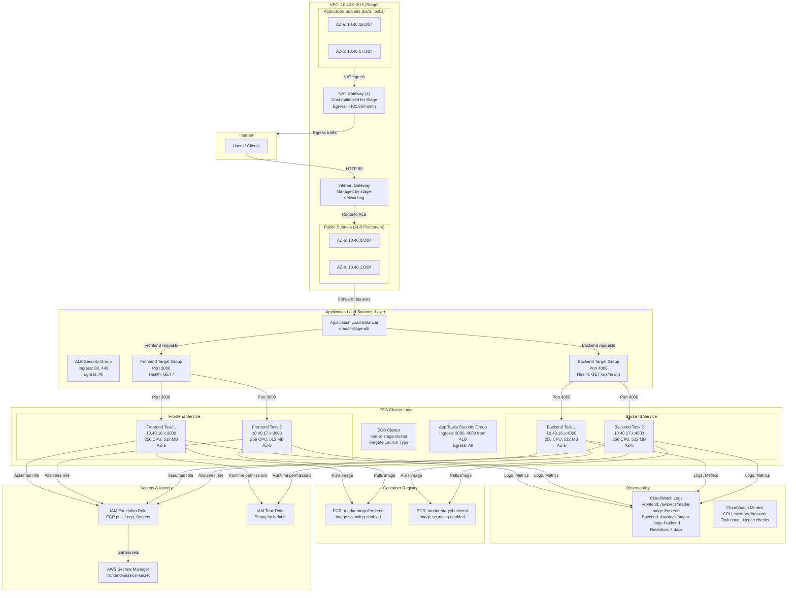
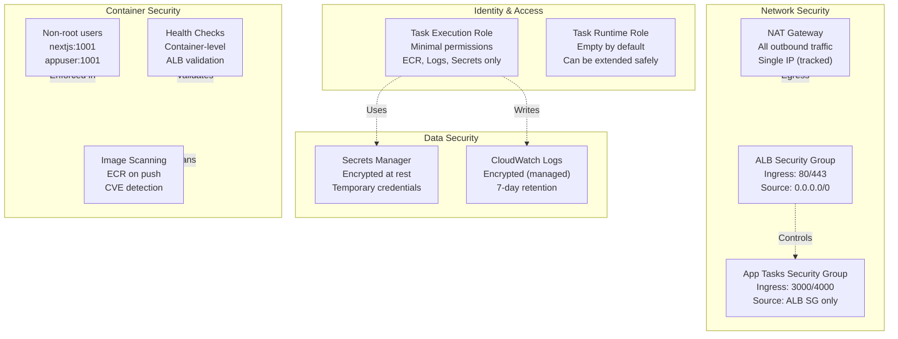

# MADAR Stage Platform - ECS Architecture

## High-Level Architecture



---

## Network Flow Diagrams

### Inbound Traffic (User → Application)

```
┌─────────────────────────────────────────────────────────────────┐
│                                                                   │
│  1. User opens: http://madar-stage-alb-123.eu-central-1.elb...  │
│                                                                   │
└────────────────┬────────────────────────────────────────────────┘
                 │
                 ▼
        ┌────────────────┐
        │  Internet (0)  │
        │   0.0.0.0/0    │
        └────────┬───────┘
                 │ DNS: ALB endpoint
                 │
                 ▼
        ┌────────────────────────────────────────────┐
        │  AWS Internet Gateway (managed by VPC)    │
        └────────┬───────────────────────────────────┘
                 │
                 ▼
        ┌────────────────────────────────────────────┐
        │  Public Subnets (10.40.0.0/24, 10.40.1.0) │
        │  Availability: AZ-a, AZ-b                  │
        └────────┬───────────────────────────────────┘
                 │
                 ▼
        ┌────────────────────────────────────────────┐
        │  Application Load Balancer                │
        │  - Listens on 0.0.0.0:80 (HTTP)           │
        │  - Receives from 0.0.0.0/0                │
        │  - ALB Security Group allows 80, 443      │
        └────────┬───────────────────────────────────┘
                 │
        ┌────────┴──────────┐
        │                   │
        ▼                   ▼
    ┌──────────────┐  ┌──────────────┐
    │ Listener 80  │  │ Listener 443 │
    │ (HTTP)       │  │ (HTTPS-Soon) │
    └──────┬───────┘  └──────────────┘
           │
           ▼ GET /
    ┌──────────────────────────────┐
    │  Frontend Target Group       │
    │  - Port 3000                 │
    │  - Health: GET / → 200 OK    │
    │  - 2 targets: AZ-a, AZ-b     │
    └──────┬───────────────────────┘
           │ Round-robin load balance
           │
    ┌──────┴────────────┐
    │                   │
    ▼                   ▼
   Task-1            Task-2
10.40.16.x:3000  10.40.17.x:3000
   AZ-a App        AZ-b App
  Subnet           Subnet

 ┌────────────────────────────────────┐
 │ App Tasks Security Group           │
 │ - Ingress: 3000 from ALB-SG        │
 │ - Ingress: 4000 from ALB-SG        │
 │ - Egress: All (0.0.0.0/0)          │
 └────────────────────────────────────┘

LATENCY BREAKDOWN:
- IGW transit: ~1ms
- ALB routing: ~5-10ms
- ECS task response: ~50-200ms
- ALB response: ~1ms
- Total: ~60-210ms (typical)
```

### Outbound Traffic (Application → Internet)

```
┌─────────────────────────────────────┐
│  ECS Task (Frontend or Backend)     │
│  10.40.16.x or 10.40.17.x           │
│  Needs internet access (logs, etc)  │
└────────────┬────────────────────────┘
             │
             ▼
    ┌────────────────────────┐
    │ Application Subnet     │
    │ 10.40.16.0/24 or       │
    │ 10.40.17.0/24          │
    │ (AZ-a or AZ-b)         │
    └────────┬───────────────┘
             │
             ▼ Route table lookup
    ┌────────────────────────────────┐
    │ Application Route Table        │
    │ 0.0.0.0/0 → NAT Gateway       │
    └────────┬───────────────────────┘
             │
             ▼
    ┌────────────────────────────────┐
    │ NAT Gateway                    │
    │ Located in: 10.40.0.x (Public) │
    │ Elastic IP: <EIP>              │
    │ Cost: ~$32.85/month            │
    │ Throughput: 45 Gbps max        │
    └────────┬───────────────────────┘
             │
             ▼
    ┌────────────────────────────────┐
    │ Internet Gateway               │
    │ Managed by networking stack    │
    └────────┬───────────────────────┘
             │
             ▼
    ┌────────────────────────────────┐
    │ Internet (0.0.0.0/0)           │
    │ - AWS API endpoints (ECR, etc) │
    │ - CloudWatch logs              │
    │ - Secrets Manager              │
    │ - External APIs (if needed)    │
    └────────────────────────────────┘

SOURCE IP: <NAT EIP> (single IP for all outbound)
RETURN TRAFFIC: Reverse NAT back to task
```

### Inter-Task Communication (Optional)

```
┌─────────────────────────────────────────────────────────┐
│ Frontend Task (10.40.16.x:3000 or 10.40.17.x:3000)     │
│ Needs to call backend API                              │
└────────────┬────────────────────────────────────────────┘
             │
             ▼ TCP 10.40.16.x:4000 or 10.40.17.x:4000
    ┌────────────────────────────────────────────────┐
    │ App Tasks Security Group                       │
    │ - Allows 3000 from ALB                         │
    │ - Allows 4000 from ALB                         │
    │ - Allows same subnet communication (implied)   │
    │ - Egress: All (0.0.0.0/0)                      │
    └────────┬───────────────────────────────────────┘
             │ Same VPC routing (no NAT needed)
             │
             ▼
    ┌────────────────────────────────────────────────┐
    │ Backend Task (10.40.16.x:4000 or 10.40.17.x)  │
    │ Receives request on port 4000                  │
    │ Responds with JSON                             │
    └────────────────────────────────────────────────┘

NETWORK BEHAVIOR:
- Direct VPC routing (no NAT)
- No internet gateway involvement
- Security group permits cross-subnet traffic
- Low latency: ~1-2ms (same AZ), ~5-10ms (cross-AZ)

STATUS: Supported by configuration but not required for MVP
```

---

## Container Lifecycle

### Task Launch Sequence

```
┌──────────────────────────────────────────────────────────────────┐
│  ECS Service decides to launch new task                          │
│  Reason: Initial deployment, scale-up, or replacement            │
└────────────┬─────────────────────────────────────────────────────┘
             │
             ▼
    ┌──────────────────────────────────────────────┐
    │ 1. Get Task Definition                       │
    │    - madar-stage-frontend:1 (or backend)     │
    │    - CPU: 256, Memory: 512 MB                │
    │    - Network mode: awsvpc                    │
    │    - Execution role: ecs-task-execution     │
    │    - Task role: ecs-task-role               │
    └────────────┬─────────────────────────────────┘
                 │
                 ▼
    ┌──────────────────────────────────────────────┐
    │ 2. Provision Infrastructure                  │
    │    - Choose AZ (AZ-a or AZ-b)               │
    │    - Select subnet (app subnet in chosen AZ) │
    │    - Allocate ENI (Elastic Network Int.)    │
    │    - Assign private IP from subnet CIDR      │
    │    - Apply security group                    │
    └────────────┬─────────────────────────────────┘
                 │
                 ▼
    ┌──────────────────────────────────────────────┐
    │ 3. Assume Execution Role                     │
    │    - STS GetCallerIdentity succeeds          │
    │    - Role ARN: arn:aws:iam::.../:role/...   │
    │    - Temporary credentials generated         │
    │    - Valid for 15-60 minutes                 │
    └────────────┬─────────────────────────────────┘
                 │
                 ▼
    ┌──────────────────────────────────────────────┐
    │ 4. Pull Image from ECR                       │
    │    - Endpoint: 123456789.dkr.ecr.<region>   │
    │    - Authenticate with token from exec role  │
    │    - Fetch image manifest                    │
    │    - Download image layers (parallel)        │
    │    - Verify image integrity                  │
    │    - Extract to container storage            │
    │    Status: PULLING_IMAGE                     │
    └────────────┬─────────────────────────────────┘
                 │
                 ▼
    ┌──────────────────────────────────────────────┐
    │ 5. Launch Container                          │
    │    - Create container namespace              │
    │    - Mount image layers (union filesystem)   │
    │    - Create rootfs                           │
    │    - Apply security context                  │
    │    - Run startup scripts (health checks)     │
    │    Status: STARTING                          │
    └────────────┬─────────────────────────────────┘
                 │
                 ▼
    ┌──────────────────────────────────────────────┐
    │ 6. Execute Container Command                 │
    │    Frontend: node -e serve(['./out'], ...)   │
    │    Backend: node /app/server.js              │
    │    - Process PID 1 (main container process)  │
    │    - Environment variables set               │
    │    - Mount volumes (if any)                  │
    │    - Expose ports (3000 or 4000)            │
    └────────────┬─────────────────────────────────┘
                 │
                 ▼
    ┌──────────────────────────────────────────────┐
    │ 7. Application Startup                       │
    │    Frontend: Starting serve on port 3000... │
    │    Backend: Backend placeholder on 4000...   │
    │    - Load configuration                      │
    │    - Initialize database (if needed)         │
    │    - Start listening for requests            │
    │    - Log startup messages to stdout/stderr   │
    │    Logs sent to: CloudWatch Logs instantly  │
    │    Status: RUNNING                           │
    └────────────┬─────────────────────────────────┘
                 │
                 ▼
    ┌──────────────────────────────────────────────┐
    │ 8. Container-Level Health Check              │
    │    - Docker/Task definition defines check    │
    │    - Frontend: GET http://localhost:3000/   │
    │    - Backend: GET http://localhost:4000/... │
    │    - Result: HEALTHY or UNHEALTHY           │
    │    - Interval: 30 seconds                    │
    │    - Timeout: 3 seconds                      │
    └────────────┬─────────────────────────────────┘
                 │
                 ▼
    ┌──────────────────────────────────────────────┐
    │ 9. Register with ALB Target Group            │
    │    - Add task IP to frontend or backend TG   │
    │    - Start ALB health checks                 │
    │    - ALB check path: / or /api/health       │
    │    - ALB check interval: 30s                │
    │    - Target state: draining → healthy       │
    │    - Traffic flowing to target               │
    └────────────┬─────────────────────────────────┘
                 │
                 ▼
    ┌──────────────────────────────────────────────┐
    │ 10. Task Ready for Traffic                   │
    │     - ECS status: RUNNING                    │
    │     - ALB status: HEALTHY                    │
    │     - Container status: RUNNING              │
    │     - Ready to serve requests                │
    │     - Receiving traffic via ALB              │
    └──────────────────────────────────────────────┘

Total Time: ~90-180 seconds (depends on image size)
```

### Task Termination Sequence

```
┌──────────────────────────────────────────────────────────────────┐
│  ECS Service initiates task termination                          │
│  Reason: Deployment, scale-down, or replacement                 │
└────────────┬─────────────────────────────────────────────────────┘
             │
             ▼
    ┌──────────────────────────────────────────────┐
    │ 1. Deregister from ALB Target Group          │
    │    - Remove task from healthy targets        │
    │    - Begin connection draining               │
    │    - Wait for existing requests to complete  │
    │    - Default timeout: 300 seconds            │
    │    - No new requests routed to task          │
    │    Target state: healthy → draining          │
    └────────────┬─────────────────────────────────┘
                 │
                 ▼
    ┌──────────────────────────────────────────────┐
    │ 2. Send SIGTERM to Main Process              │
    │    - PID 1 receives SIGTERM signal           │
    │    - Application can handle gracefully       │
    │    - Close client connections                │
    │    - Flush logs                              │
    │    - Release resources                       │
    │    - Expected: Clean shutdown logic          │
    │    Status: DEPROVISIONING                    │
    └────────────┬─────────────────────────────────┘
                 │
                 ▼
    ┌──────────────────────────────────────────────┐
    │ 3. Wait for Graceful Shutdown                │
    │    - Timeout: 120 seconds (default)          │
    │    - Process can catch SIGTERM and cleanup   │
    │    - Backend: process.on('SIGTERM', ...)    │
    │    - Frontend: may not handle (stateless)    │
    │    - CloudWatch logs may cut off abruptly   │
    └────────────┬─────────────────────────────────┘
                 │
                 ▼ (if not exited)
    ┌──────────────────────────────────────────────┐
    │ 4. Force Kill (SIGKILL) if Needed            │
    │    - Send SIGKILL if timeout exceeded        │
    │    - No chance for app to handle             │
    │    - Immediate termination                   │
    │    - May lose in-flight requests             │
    └────────────┬─────────────────────────────────┘
                 │
                 ▼
    ┌──────────────────────────────────────────────┐
    │ 5. Release Infrastructure                    │
    │    - Stop container                          │
    │    - Unmount filesystem                      │
    │    - Release ENI                             │
    │    - Release private IP                      │
    │    - Release security group reference        │
    │    Status: STOPPED                           │
    └────────────┬─────────────────────────────────┘
                 │
                 ▼
    ┌──────────────────────────────────────────────┐
    │ 6. Clean Up Task                             │
    │    - Remove task from ECS cluster            │
    │    - Archive CloudWatch logs                 │
    │    - Release execution role credentials      │
    │    - Mark task as STOPPED                    │
    │    - Available in UI for 1 hour              │
    └──────────────────────────────────────────────┘

Total Time: ~120-420 seconds (depends on graceful shutdown)
```

---

## Monitoring & Observability

### CloudWatch Log Groups

```
┌─────────────────────────────────────────────────────────────────┐
│  /aws/ecs/madar-stage-frontend                                 │
│  ├─ Log Group Settings                                         │
│  │  ├─ Retention: 7 days                                       │
│  │  ├─ KMS Encryption: AWS Managed                            │
│  │  └─ Region: eu-central-1                                   │
│  ├─ Log Streams (per task)                                    │
│  │  ├─ ecs/madar-stage-frontend/xxx-task-1                   │
│  │  │  ├─ [Task startup] Node version 22...                  │
│  │  │  ├─ Starting serve on port 3000...                     │
│  │  │  ├─ [2026-06-24T10:30:15Z] GET / 200 OK               │
│  │  │  └─ [2026-06-24T10:30:20Z] GET /assets/app.js 200 OK  │
│  │  └─ ecs/madar-stage-frontend/xxx-task-2                  │
│  │     └─ [Similar logs]                                      │
│  └─ Insights Queries                                          │
│     └─ fields @timestamp, @message                            │
│        | filter @message like /ERROR/                         │
│        | stats count() by @message                            │
│
└─────────────────────────────────────────────────────────────────┘

┌─────────────────────────────────────────────────────────────────┐
│  /aws/ecs/madar-stage-backend                                  │
│  ├─ Log Group Settings                                         │
│  │  ├─ Retention: 7 days                                       │
│  │  ├─ KMS Encryption: AWS Managed                            │
│  │  └─ Region: eu-central-1                                   │
│  ├─ Log Streams (per task)                                    │
│  │  ├─ ecs/madar-stage-backend/xxx-task-1                    │
│  │  │  ├─ [Task startup] Node version 22...                  │
│  │  │  ├─ Backend placeholder listening on 4000              │
│  │  │  ├─ [2026-06-24T10:30:15Z] GET /api/health 200 OK     │
│  │  │  └─ [2026-06-24T10:30:20Z] Error: (none expected)     │
│  │  └─ ecs/madar-stage-backend/xxx-task-2                   │
│  │     └─ [Similar logs]                                      │
│  └─ Insights Queries                                          │
│     └─ fields @timestamp, @message, @duration                │
│        | filter @message like /ERROR/ or @duration > 1000    │
│        | stats count() by @message                            │
│
└─────────────────────────────────────────────────────────────────┘
```

### CloudWatch Metrics

```
ECS Cluster Metrics:
├─ CPU utilization (0-100%)
│  ├─ Average: ~15-20% (expected for light stage traffic)
│  └─ Peak: <50% (room for growth)
├─ Memory utilization (0-100%)
│  ├─ Average: ~25-35% (well within 512 MB limit)
│  └─ Peak: <60% (headroom for spikes)
└─ Task count
   ├─ Running: 4 (2 frontend + 2 backend)
   ├─ Desired: 4
   └─ Healthy: 4

ALB Metrics:
├─ Request Count
│  ├─ HTTP 2xx: Increasing (good)
│  ├─ HTTP 4xx: User errors (0 expected for stage)
│  ├─ HTTP 5xx: Server errors (0 expected)
│  └─ ALB is working normally
├─ Target Response Time
│  ├─ Average: ~100-200ms
│  ├─ p99: <500ms
│  └─ Normal for app processing
├─ New Connections
│  ├─ Increasing during business hours
│  ├─ Dropping during off-hours
│  └─ Load distribution working
└─ Active Connections
   ├─ Typical range: 0-10 (stateless HTTP)
   ├─ Low memory footprint per connection
   └─ No connection pooling issues

Target Group Metrics:
├─ Healthy Host Count
│  ├─ Frontend TG: 2 (both healthy)
│  ├─ Backend TG: 2 (both healthy)
│  └─ Full redundancy
├─ Unhealthy Host Count
│  ├─ Frontend TG: 0
│  ├─ Backend TG: 0
│  └─ No failures
├─ Request Count
│  ├─ Per target: Balanced
│  ├─ No hotspots
│  └─ Round-robin working
└─ Response Time
   ├─ Per target: <200ms average
   ├─ Consistent across AZs
   └─ No latency variance
```

---

## Security Posture



---

## Capacity & Scaling

### Current Configuration (Stage)

| Resource | Current | Limit | Usage | Headroom |
|----------|---------|-------|-------|----------|
| **Frontend Tasks** | 2 | No limit | ~30% CPU | 140% |
| **Backend Tasks** | 2 | No limit | ~10% CPU | 190% |
| **Memory (Frontend)** | 512 MB | 512 MB | ~30% | 70% |
| **Memory (Backend)** | 512 MB | 512 MB | ~20% | 80% |
| **ALB Throughput** | 1 LCU | Unlimited | ~5% | 95% |
| **NAT Gateway** | 1 | 1 | <1% | >99% |
| **ECR Repositories** | 2 | Unlimited | ~500 MB | Unlimited |
| **CloudWatch Logs** | ~50-100 GB/mo | Unlimited | ~50 GB/mo | Unlimited |

### Future Scaling Options

1. **Vertical Scaling (Task Size)**
   - Increase CPU: 256 → 512 → 1024 mCPU
   - Increase Memory: 512 MB → 1 GB → 2 GB
   - Cost impact: Linear with resources

2. **Horizontal Scaling (Task Count)**
   - Increase frontend: 2 → 4 → 8
   - Increase backend: 2 → 4 → 8
   - Cost impact: Linear per task

3. **Auto Scaling (Future Sprint)**
   - Scale based on CPU/memory utilization
   - Scale based on ALB request count
   - Scale based on CloudWatch metrics

4. **Multi-Region Scaling (Production)**
   - Replicate infrastructure to us-east-1
   - Use Route53 for failover
   - CloudFront for content delivery
